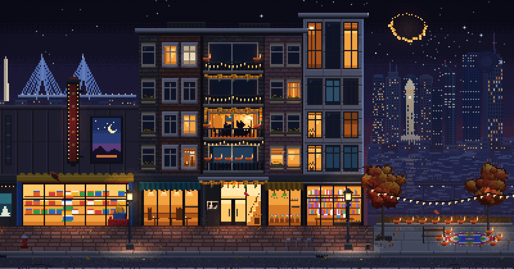

# Purrfect Year

[](https://youtu.be/6n0dwj57O9g)

An animated pixel-art diary of one year, told in 16 entries from Diwali 2025 to Halloween 2026.

▶ **Watch the two-minute film, *Paws and Seasons*, on YouTube (4K):** https://youtu.be/6n0dwj57O9g

One black cat appears in every entry, and he never changes. Everything around
him moves on. The places change (Boston, New York, Los Angeles, San Diego and
Herndon, Virginia), and so do the seasons, the festivals, the weather, the time
of day and the people around him.

Each entry is a seamless 240-second loop, made to be the cover of long lofi
videos, and each has its own original soundtrack, generated in code.

- **Crisp at 1080p and 4K.** The art is drawn at 480×270 and scaled by whole
  numbers, so every art pixel becomes an exact 4×4 block at 1920×1080 and 8×8
  at 3840×2160.
- **Seamless loops.** Every frame is a pure function of the time `t` in a 240 s
  loop. Nothing carries over from one frame to the next, so the frame at
  `t = 240` is the frame at `t = 0`. Copies of an exported loop join without a
  seam, and the live page can run for days without drifting.
- **Night, dusk, golden hour and day.** Each entry has its own time of day. The
  scene is relit per pixel: lamps, windows and fires pour banded, dithered pools
  of light at night, and by day sunlight fills the scene and the buildings,
  trees and lamps cast shadows.
- **Original soundtrack.** Each entry has its own music, generated in plain
  Node and timed to what happens in the picture, such as fireworks and
  lightning.

## The 16 entries

The id is what the tools take (`--edition ID`) and what the page puts in its URL (`#ID`).

| # | Entry (id) | Festival or occasion | Date | City | Time of day | Sky and weather | Live page shows it |
|---|---|---|---|---|---|---|---|
| 1 | Festival of Lights (`diwali`) | Diwali | October 20, 2025 | Boston | night | clear and starry, fireworks and sparklers, a few leaves | Oct 15–27 and Nov 4–19 |
| 2 | Rainy Hollow (`halloween25`) | Halloween | October 31, 2025 | Boston | night | rain and lightning | not by date (picker or link) |
| 3 | Thanksgiving (`thanksgiving`) | Thanksgiving | November 27, 2025 | Boston | golden hour | broken cloud, falling leaves | Nov 20–30 |
| 4 | Snowfall (`christmas`) | Christmas & Hanukkah | December 2025 | Boston | night | heavy snow | Dec 1–30 |
| 5 | Midnight (`newyear`) | New Year's Eve | December 31, 2025 | Boston | night | clear, light snow, fireworks | Dec 31 – Jan 15 |
| 6 | Red Lanterns (`lunar`) | Lunar New Year | February 17, 2026 | Boston | night | clear, light snow, fireworks | Jan 16 – Mar 14 |
| 7 | Blossom Morning (`easter`) | Easter | April 5, 2026 | Boston | day | fair-weather clouds, blossom petals | Mar 15 – May 20 |
| 8 | Firefly Midsummer (`midsummer`) | Midsummer | June 2026 | Boston | dusk | clear, fireflies | May 21 – Jun 10 |
| 9 | Match Night (`match`) | Football summer | June – July 2026 | Boston | night | clear, fireflies | Jun 11 – Jul 3 |
| 10 | Fourth in New York (`nyc`) | Fourth of July | July 4, 2026 | New York | night | clear, fireworks | Jul 4–7 |
| 11 | West Coast (`la`) | Summer trip | July 2026 | Los Angeles | day | clear and dry | Jul 8–15 |
| 12 | Zoo, Bricks & Bay (`sandiego`) | Summer trip | July 2026 | San Diego | day | fair-weather clouds, gulls | Jul 16–31 |
| 13 | Birthday in Virginia (`dc`) | A birthday | August 2026 | Herndon, Virginia | dusk | clear, fireflies | Aug 1–24 |
| 14 | Home to Boston (`home`) | End of summer | late August 2026 | Boston | dusk | twilight, fireflies | Aug 25–31 |
| 15 | Golden Harvest (`harvest`) | Harvest & Mid-Autumn | September 2026 | Boston | golden hour | broken cloud, falling leaves, harvest moon | Sep 1 – Oct 14 |
| 16 | Rainy Hollow (`halloween`) | Halloween | October 31, 2026 | Boston | night | rain and lightning | Oct 28 – Nov 3 |

Everything about an entry (place, light, sky, weather, season, fire pit,
fireworks, decorations) lives in [`src/editions.js`](src/editions.js).

## The live page

Open `index.html` in a browser. It needs no server and no build step.

- It opens on **today's entry**: the one whose dates contain today's date in
  Boston (`America/New_York`), wherever the viewer is. The last column above
  lists the dates.
- The buttons along the bottom pick an entry. A title card shows the entry's
  number, name, festival and date for a few seconds. The URL changes to `#id`, so
  a link opens that entry.
- The controls and the cursor hide after two seconds without mouse movement.
  With reduced motion turned on in the system, the page starts paused.

| key | action |
|---|---|
| `←` `→` | previous / next entry |
| `1`–`9`, `0` | jump to entries 1–9, and `0` to entry 10 |
| `F` or double-click | fullscreen |
| `Space` | pause / resume |
| `H` | stats: time in the loop, fps, render time |

URL options: `?edition=ID` (or `#ID`), `?t=42` start time in seconds,
`?speed=0.5`, `?pause=1`, `?hud=1`, `?fit=stretch` (scale to the largest size
that fits the window, even by a fractional factor, instead of the largest whole
number; the picture stays 16:9, but art pixels may then be slightly uneven),
`?loop=240` (loop length in seconds).
Debug views: `?view=light` (the lightmap), `?view=albedo` (the scene layer
before relighting), `?view=scene` (the relit scene layer alone), `?view=em`
(emissive pixels), and `?only=a,b` or `?skip=a,b` with module names (see
[Project structure](#project-structure)).

## Setup

You need:

- **Node 18 or newer**
- **Playwright with Chromium.** The tools render in headless Chromium.
- **ffmpeg** on your `PATH`, for the videos

```bash
git clone https://github.com/aztmm1/purrfect-year.git
cd purrfect-year
npm install --no-save playwright@1.56.1   # Playwright into node_modules/ (git ignores it)
npx playwright install chromium           # skip if Playwright's Chromium is already installed
ffmpeg -version                           # check that ffmpeg is on the PATH
```

The tools also find a Playwright installed globally (`npm install -g playwright`).
The video tools write to `out/` by default; pass `--out` for the others.
`out/`, `dist/` and `review/` are git-ignored.

## Tools

Run the tools from the repository root. The tools that render one entry take
`--edition ID` (an id from the table; the default is `halloween`).

### Videos

The renderer computes each frame directly from `t`, so frames are exact and
none are dropped. It doesn't capture the screen.

```bash
# the year in two minutes: all 16 entries in order (7.5 s each) with the soundtrack
node tools/make-year.mjs   # -> out/purrfect-year-2min-4k.mp4 (3840×2160)
                           #    out/purrfect-year-2min-1080p.mp4 (1920×1080)
```

- Each entry shows its name and date as a small pixel-font lower third.
  `--no-titles` turns it off.
- Both files come from one encoding pass; the 1080p copy is the same picture at
  half size. `--no-share` skips it.
- `--resume` reuses the segments and audio that are already rendered, `--crf N`
  sets the quality, and `--probe` prints candidate start moments for each entry.

One entry as a seamless loop (7200 frames at 30 fps):

```bash
node tools/render-video.mjs --edition christmas --out out/christmas-loop-1080p.mp4
```

| option | meaning |
|---|---|
| `--scale 4` | 4 = 1920×1080 (default), 8 = 3840×2160 |
| `--fps 30` | frame rate |
| `--codec h264` | `h264`, `h265`, `prores` (`.mov` for editing) or `lossless` (RGB `.mkv`, very large) |
| `--crf 14 --preset slow` | encoder quality and speed |
| `--seconds N --start S` | render `N` seconds from loop time `S` (default: exactly one loop from 0) |
| `--crop x,y,w,h` | render only part of the 480×270 frame |
| `--pad WxH` | centre the picture on a black `W`×`H` canvas |
| `--fade S` | fade in from and out to black over `S` seconds |
| `--overlay FILE.json` | titles and bands drawn in art pixels (see `tools/titles.mjs`) |
| `--audio FILE.wav` | mux an audio track |
| `--audio auto` | render this entry's soundtrack for the same stretch (a silent track, with a warning, if that fails) |
| `--loop 240` | loop length in seconds |

A long lofi video: render one loop, render its soundtrack as one loop, and repeat
both without re-encoding the picture.

```bash
node tools/render-video.mjs --edition christmas --scale 8 --out out/christmas-loop-4k.mp4
node tools/soundtrack.mjs --edition christmas --loop --out out/christmas-loop.wav
tools/make-long.sh out/christmas-loop-4k.mp4 out/christmas-loop.wav 60 out/christmas-60min.mp4
```

`make-long.sh` takes the loop, an audio file, the length in minutes (3 by
default) and the output file. You can pass your own music file instead of the
WAV. If the loop was split into parts (`…-part1-of-6.mp4`), pass part 1 and the
script joins the rest losslessly first.

### Soundtrack

```bash
node tools/soundtrack.mjs --edition easter --start 0 --seconds 30 --out out/easter.wav
node tools/soundtrack.mjs --edition easter --loop --out out/easter-loop.wav
```

This renders an entry's music and ambience for loop time `[S, S+N)` as a
48 kHz 16-bit stereo WAV (`--rate` changes the sample rate). `--loop` renders
the whole 240 s loop so that it repeats seamlessly. The output is deterministic,
and events land on the same loop time as in the picture. `make-year.mjs` calls
it itself, and `render-video.mjs` does with `--audio auto`. If it fails, they
still make the video, with a silent audio track.

### Stills, checks and builds

```bash
# still frames (comma-separated times, e.g. --t 0,40,120, give one PNG each: <out>-t<T>.png)
node tools/shot.mjs --edition match --t 40 --scale 4 --out out/match.png
#   [--crop x,y,w,h] [--only sky,street] [--skip weather] [--view light|albedo|scene|em]

# contact sheet of consecutive frames, to review motion as one image
node tools/sheet.mjs --edition diwali --t0 10 --dt 0.0333 --n 12 --cols 4 --crop 330,170,110,60 --scale 3 --out out/diwali-sheet.png

# loop, determinism, live switching, seam and error checks
node tools/verify.mjs --quick --edition harvest

# time per module and per frame at 1080p
node tools/perf.mjs --edition harvest [--frames 300]

# the page as one HTML file, every script inlined
node tools/build.mjs                     # -> dist/purrfect-year.html
node tools/build.mjs --out docs/index.html   # the page GitHub Pages publishes
```

`verify.mjs` checks the following:

- `src/` contains no `Math.random`, wall-clock time, timers or anti-aliased canvas calls.
- The frames at `t` and `t + 240`, with time left unwrapped, match pixel for
  pixel (a few pixels flipped by float rounding are allowed).
- Seeking doesn't depend on earlier frames, and a fresh page load gives identical pixels.
- Switching through every entry and back leaves no trace.
- The jump from the end of the loop back to 0 changes no more pixels than a normal frame step.
- Frame time stays within budget, and the JS heap stays flat over thousands of frames.

Headless Chromium draws the canvas in software, so `perf.mjs` and the frame-time
check give upper bounds. A browser on a GPU is faster.

## Project structure

```
index.html              the live page: canvas, entry picker, title card; loads every script below
src/
  engine.js             frame pipeline, loop-safe time helpers, pixel drawing API, lights,
                        daylight and shadows, relighting, puddle reflections, display, export hooks
  palette.js            colour ramps (HD.PAL) and light colours (HD.LIGHT)
  layout.js             the title-safe sky area and other shared constants
  editions.js           the 16 entries, the time-of-day table (HD.light) and live switching
  places.js             the six places and their anchors (HD.place, HD.placeTop)
  festive.js            small shared lights: flames, diyas, string lights, lanterns
  summer.js             shared event timing, so every module agrees on when things happen
  mascot.js             the series cat at his window (HD.mascot)
  sky.js                skies for every time of day: sun, moon, stars, clouds, lightning
  backdrops.js          the far city behind each place
  street.js             sidewalks, curbs, roads, lamps, street trees, passing cars, cast shadows
  building-apt1.js      Boston: an apartment building and its block
  building-apt2.js      Boston: another apartment building and its corner
  building-soho.js      New York: a street of cast-iron lofts
  building-bhills.js    Los Angeles: a street under tall palms
  building-marina.js    San Diego: the waterfront by the marina
  building-herndon.js   Herndon, Virginia: a house with a front porch and a lawn
  decor-boston.js       seasonal decorations at the two Boston places
  decor-trips.js        props in New York, Los Angeles, San Diego and Herndon
  fire.js               the fire pit
  fire-seasons.js       fireworks and sparklers
  weather.js            rain, splashes, drips and ripples
  weather-seasons.js    snow, leaves, petals, fireflies and gulls
  atmosphere.js         smoke, steam, mist, haze, sun shafts and the vignette
  atmosphere-seasons.js which atmosphere each entry gets
  family.js             every cat other than the series cat at his window
  brand.js              the small AZTMM sign at each place and the New Year logo firework
tools/
  make-year.mjs         the two-minute year video (4K and 1080p)
  render-video.mjs      one entry as a seamless loop
  make-long.sh          a long video from one loop and an audio file
  shot.mjs, sheet.mjs   still frames and contact sheets
  verify.mjs, perf.mjs  loop and determinism checks, timing per module
  build.mjs             the page as one HTML file
  lib.mjs               shared helpers: Playwright, arguments, entries, jobs, WAV files
  titles.mjs, pixfont.mjs  title overlays and the pixel font for the videos
  sound/                the soundtrack: composition, instruments, DSP, picture events
  regress.mjs, review-kit.mjs, regress-halloween.json
                        legacy: v1 review tools, not yet updated for v2
assets/                 the AZTMM logo
docs/                   the published page (GitHub Pages)
preview-1080p.png       legacy: the v1 preview image
```

The files from `sky.js` down each register a module with
`HD.module(name, …)`; a `*-seasons.js` file belongs to the module of the same
base name. Use the module names with `--only` and `--skip`: `sky`,
`backdrops`, `street`, `building-apt1` … `building-herndon`, `decor-boston`,
`decor-trips`, `fire`, `weather`, `atmosphere`, `family`, `brand`.

[ART.md](ART.md) covers the art direction and the module contract: pixel rules,
the palette and lighting model, the time-of-day system, loop rules, layers and
places.

## Publishing the page

GitHub Pages publishes the `docs/` folder. `docs/index.html` is the whole live
page in one file, made by `node tools/build.mjs --out docs/index.html`, which
inlines every script of `index.html`. The pixel font of the title card loads
from Google Fonts; offline, the page falls back to a monospace font.
`docs/og.png` is the preview image for links, and `docs/.nojekyll` makes Pages
serve the files as they are, without a Jekyll build.

1. On GitHub, open the repository's **Settings** and go to **Pages**.
2. Under **Build and deployment**, set **Source** to **Deploy from a branch**.
3. Choose the branch **main** and the folder **/docs**, then click **Save**.

After a minute or two the page is live at
<https://aztmm1.github.io/purrfect-year/>. Each push to `main` republishes it.

## Credits

Made by **AZTMM**.

© 2026 AZTMM. All rights reserved. The artwork, the music and the code are not
open source, and no licence is granted to copy, modify or redistribute them.
